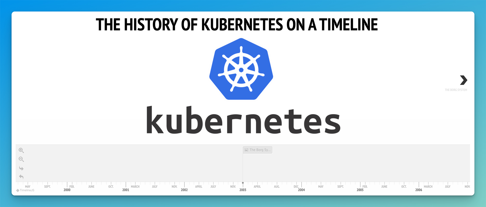

## Kubernetes 10 Year Anniversary - Try out Kubernetes v1.0 - Free in your browser!


<p align="center">
  
</p>


✨ This tutorial will allow you to run Kubernetes v1.0 - in your browser by making use of the Free Google Cloud Shell tier that can be used without enrollment. Click the "Open in Google Cloud Shell" button, sign in with Google, do not trust the repo (as we want to run this as an ephemeral environment that is discarded after use) and then follow the tutorial on the right hand side 🚀

Credits to [Carlos Santana](https://github.com/csantanapr), [Amim Moises Salum Knabben](https://github.com/knabben) & [James Spurin](https://github.com/spurin)

Carlos Santana kicked off the fun in the CNCF Ambassador chat room, sparking a brilliant idea to celebrate Kubernetes' 10-year anniversary! Amim dived deep, tackling key challenges and identifying core issues. Meanwhile, James Spurin whipped up some nifty workarounds with this virtual environment.

Together, they've crafted this engaging tutorial. Dive in, have fun, and join us in cheering for a fantastic decade of Kubernetes! 🎉 ✨

[](https://ssh.cloud.google.com/cloudshell/editor?cloudshell_git_repo=https://github.com/spurin/kubernetes-v1.0-lab.git&cloudshell_git_branch=main&cloudshell_tutorial=tutorial.md&shellonly=true)

## Run in Lima VM

[Anders Björklund](https://github.com/afbjorklund) has also done some great work, allowing you to run the pre-requisite VM environment yourself with [Lima VM](https://github.com/lima-vm/lima).

Start the instance with  -

```
limactl start --tty=false --cpus 2 --memory 8 https://raw.githubusercontent.com/spurin/kubernetes-v1.0-lab/main/lima.yaml
```

Example usage -

```
% limactl start --tty=false --cpus 2 --memory 8 https://raw.githubusercontent.com/spurin/kubernetes-v1.0-lab/main/lima.yaml
INFO[0000] Terminal is not available, proceeding without opening an editor
INFO[0000] Starting the instance "lima" with VM driver "qemu"
INFO[0000] Attempting to download the image              arch=x86_64 digest="sha256:a348500d04de3352af3944e9dae99a08d60091221e1370941b93bd7a27971568" location="http://cloud-images-archive.ubuntu.com/releases/vivid/release-20160203/ubuntu-15.04-server-cloudimg-amd64-disk1.img"
INFO[0000] Using cache "/Users/james/Library/Caches/lima/download/by-url-sha256/77c902f99f70b354e56b996968a3838834ff4616a650c2a3b45490ba26927ac8/data"
INFO[0000] [hostagent] hostagent socket created at /Users/james/.lima/lima/ha.sock
INFO[0000] [hostagent] Starting QEMU (hint: to watch the boot progress, see "/Users/james/.lima/lima/serial*.log")
INFO[0000] SSH Local Port: 51278
INFO[0000] [hostagent] Waiting for the essential requirement 1 of 2: "ssh"
INFO[0028] [hostagent] Waiting for the essential requirement 1 of 2: "ssh"
INFO[0038] [hostagent] Waiting for the essential requirement 1 of 2: "ssh"
INFO[0051] [hostagent] The essential requirement 1 of 2 is satisfied
INFO[0051] [hostagent] Waiting for the essential requirement 2 of 2: "user session is ready for ssh"
INFO[0051] [hostagent] The essential requirement 2 of 2 is satisfied
INFO[0051] [hostagent] Waiting for the guest agent to be running
INFO[0051] [hostagent] Forwarding "/run/lima-guestagent.sock" (guest) to "/Users/james/.lima/lima/ga.sock" (host)
INFO[0051] [hostagent] Guest agent is running
INFO[0051] [hostagent] Waiting for the final requirement 1 of 1: "boot scripts must have finished"
INFO[0051] [hostagent] Not forwarding TCP 0.0.0.0:22
INFO[0051] [hostagent] Not forwarding TCP [::]:22
INFO[0091] [hostagent] Waiting for the final requirement 1 of 1: "boot scripts must have finished"
INFO[0097] [hostagent] The final requirement 1 of 1 is satisfied
INFO[0098] READY. Run `limactl shell lima` to open the shell.

% limactl shell lima
james@lima-lima:~$
```

From this point you can follow the [tutorial](tutorial.md) onwards from the step - [Check for cgroups v1, it should say tmpfs](tutorial.md#Start-here-when-using-Lima)

## Interactive Kubernetes Timeline

Try out the [Interactive Kubernetes Timeline!](https://blog.risingstack.com/the-history-of-kubernetes) 🚀

<p align="center">
  <a href="https://blog.risingstack.com/the-history-of-kubernetes"></a>
</p>

_Interactive Kubernetes Timeline Credit - Ferenc Hámori - https://blog.risingstack.com/the-history-of-kubernetes_

## Star History

[](https://star-history.com/#spurinkubernetes-v1.0-lab&Date)
